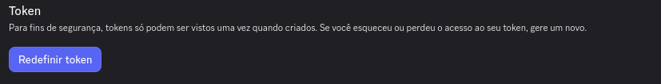

# AxxiomBot

> [!IMPORTANT]
Este projeto está atualmente em fase de desenvolvimento e pode conter funcionalidades incompletas, bugs e mudanças incompatíveis.
O código nesta branch não deve ser considerado estável ou pronto para uso.

---

Um bot administrativo para o Discord, projetado para facilitar processos, tarefas e problemas comuns.  
futuramente pretendo ligar esse bot a outros contextos, se estendendo com outros projetos.  

funcionalidades atuais:
* criar um grupo de pontuações (tags)
* listagem de perfil de usuários
* pegar fatos de catfact (https://catfact.ninja)
* pegar tempo de resposta de um servidor
* calculadora básica

implementações futuras:

- minigames
- meme aleatório
- jogo da vida (de alguma forma)
- 1 musica aleatória por dia
- jogo de palavras
- rank de algo com enquete
- IA simples

# configuração

[discord applications](https://discord.com/developers/applications)

* primeiramente é preciso colocar informações 
* primeiramente acesse o discord application;
* crie um novo aplicativo
* acesse a aba bot e copie o token resetando ele:  
* cole o token e preencha outras informações em `.env_example` na base do projeto
* renomeie para `.env`

em seguida use `make run` na base do projeto para iniciar o bot

criar novo aplicativo: 

## nome e contexto

# checklist atual

* [x] colocar mais coisas na checklist
* [x] escolher um bom nome
* [ ] fazer o bot para outros idiomas
* [ ] github pages
* [ ] atualizar README e documentações
* [ ] implementar banco de dados para comandos do bot
* [ ] implementar comandos de administração
* [ ] implementar docker
* adaptar arquiteturas dependendo da fase do projeto

# Como contribuir

<!-- [CONTRIBUTING.md](./CONTRIBUTING.md) -->
1. Faça um fork do projeto
2. Crie uma branch com a nova feature (`git checkout -b feat/your-feature`)
5. faça um Pull Request
